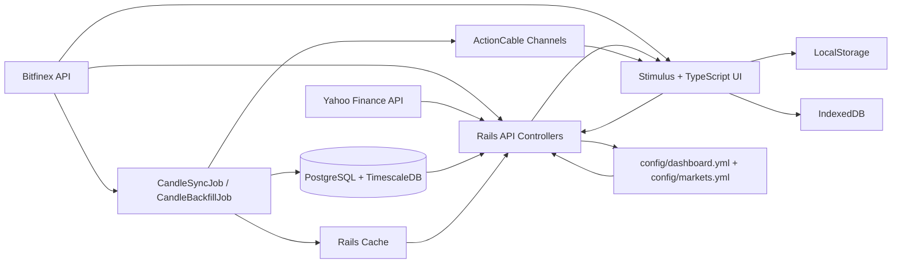

# Architecture

## Кратко

Приложение построено как монолит на Rails с фронтендом на TypeScript/Stimulus. Исторические свечи хранятся в PostgreSQL с TimescaleDB, фоновая синхронизация выполняется через Solid Queue, а realtime-обновления приходят двумя путями: через backend ActionCable и через прямой публичный WebSocket Bitfinex в браузере.

## Внешние интеграции

| Интеграция | Назначение | Как используется |
| --- | --- | --- |
| Bitfinex API | История свечей, live tickers и public WebSocket candles | Бэкофилл, регулярная синхронизация, тикеры, прямой realtime feed для графиков |
| Yahoo Finance | Котировки индексов, forex, commodities | Плитки рынка на главной странице |

## Архитектурная схема

## Backend

### Rails controllers

API сгруппирован вокруг нескольких доменных областей:

- auth и registration;
- candles и tickers;
- indicators;
- data table statistics и correlations;
- dashboard и markets;
- presets;
- service endpoints вроде `health`.

Маршруты: [config/routes.rb](../config/routes.rb)

### Модель данных и запросы

Основная сущность бэкенда это `Candle`.

- raw `1m` данные читаются напрямую из таблицы `candles`;
- таймфреймы `5m`, `15m`, `1h`, `4h`, `1d` читаются из continuous aggregates;
- прочие таймфреймы строятся on-the-fly через `time_bucket`.

### Background jobs

Основные фоновые задачи:

- `CandleSyncJob`: минутная синхронизация по всем crypto symbols;
- `CandleSyncSymbolJob`: точечная синхронизация одного символа;
- `CandleBackfillJob`: историческая загрузка данных назад во времени.

Jobs используют `Candle::Fetcher`, который умеет:

- добирать свежие свечи;
- выполнять исторический backfill;
- обновлять continuous aggregates;
- отправлять новые свечи в ActionCable.

### Realtime

Backend через ActionCable используется для двух потоков:

- `candles:<symbol>:<timeframe>` для новых свечей;
- `exchange:status` для статуса доступности Bitfinex.

Отдельно браузерские графики могут получать live candles напрямую из публичного Bitfinex WebSocket. Это не заменяет backend, а дополняет его:

- ActionCable зависит от backend;
- direct Bitfinex WS зависит от интернета и доступности Bitfinex;
- UI соединяет оба источника поверх локального кэша свечей.

### Connectivity model

Во фронтенде различаются три независимых статуса:

- `internetOnline`: есть ли доступ в интернет у браузера;
- `backendOnline`: отвечает ли backend по `/api/health`;
- `bitfinexReachable`: доступен ли Bitfinex по последнему известному snapshot и push-событиям.

Это важно, потому что "сервер приложения доступен" и "биржа доступна" в проекте не одно и то же состояние.

- `/api/health` используется как heartbeat backend для фронтенда;
- JSON-ответ этого endpoint одновременно содержит snapshot `bitfinex`;
- актуализация exchange-status дополнительно приходит через `exchange:status`.

Подробно про деградацию режимов: [08 Offline Mode](08-offline-mode.md)

## Frontend

### Основной стек

- Stimulus controllers для экранов и интерактивности;
- TypeScript-модули для графиков, табов, data grid и сервисов;
- Lightweight Charts для графиков;
- AG Grid для табличного анализа;
- Tailwind CSS для оформления.

## Слои фронтенда

### Navigation и shell

Корневой экран переключает `Main` и `Graph`, а также управляет auth-областью.

### Tabs и chart workspace

Графический workspace хранит:

- табы;
- панели;
- оверлеи;
- привязку data tabs к chart panels;
- графические примитивы и volume profile.

### Data grid engine

Data tabs работают как отдельный аналитический слой. Они загружают данные с сервера, строят вычисляемые колонки, применяют условия и генерируют сигналы торговых систем.

Если data tab связан с chart tab, появляются дополнительные механики:

- базовый symbol и timeframe наследуются из связанного chart context;
- timeframe синхронизируется между linked chart panel и data tab;
- conditions и system markers могут отражаться на графике;

## Storage и состояние

Состояние системы разложено по нескольким уровням:

| Где хранится | Что хранится |
| --- | --- |
| PostgreSQL / TimescaleDB | История свечей, пользователи, пресеты, очереди |
| YAML-файлы в `config/` | Состав dashboard symbols и market symbols |
| LocalStorage | Табы, активный таб, активная страница, локальное состояние интерфейса |
| IndexedDB | Локальный кэш свечей и индикаторных рядов для cold start и degraded/offline mode |
| Rails cache | Snapshot статуса Bitfinex, tickers, min/max timestamps, Yahoo quotes |

Важно:

- `preset payload` не отдельный storage layer;
- это JSON, который лежит в PostgreSQL в `presets.payload`.

## Каталоги, которые важно знать

| Путь | Назначение |
| --- | --- |
| `app/controllers/api` | JSON API |
| `app/models/candle` | Запросы свечей, fetcher, индикаторы |
| `app/jobs` | Фоновые синхронизации |
| `app/channels` | Realtime-каналы |
| `app/javascript/controllers` | Stimulus controllers |
| `app/javascript/chart` | Логика графиков |
| `app/javascript/data` | Browser caches: candle cache, indicator cache, IndexedDB |
| `app/javascript/data_grid` | Табличный анализ и системы |
| `app/javascript/tabs` | Управление workspace и persistence |
| `config/configs` | Конфигурации внешних рынков и приложения |
| `db/migrate` | Миграции TimescaleDB, users, presets, queues |

## Что важно помнить при изменениях

- Данные crypto и market tiles живут в разных потоках.
- В проекте есть несколько уровней persistence: PostgreSQL, YAML, localStorage, IndexedDB и Rails cache.
- `Preset.payload` это JSONB в PostgreSQL, а не отдельное клиентское хранилище.
- Изменение схемы `tabs` в localStorage и структуры `Preset.payload` требует внимания к обратной совместимости.
- Изменение связки chart/data tabs требует отдельно проверять `chartLinks`, `sourceTabId`, sync timeframe и поведение systems/stats tabs.
