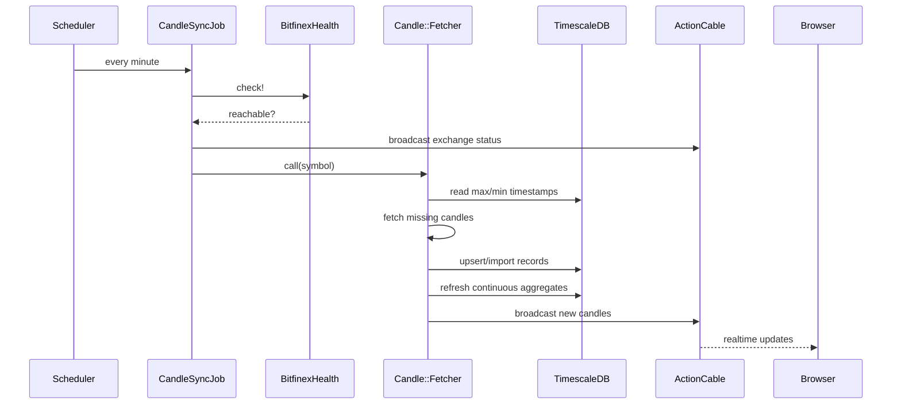

# Jobs and Realtime

## Зачем это нужно

Проект постоянно подтягивает новые данные, обновляет агрегаты и доставляет изменения в UI почти в realtime. При этом realtime в системе двуслойный:

- server-side ingestion и broadcast;
- client-side live feeds и browser caches.

## Основные jobs

### `CandleSyncJob`

Главная периодическая задача.

Что делает:

1. Проверяет доступность Bitfinex.
2. Публикует статус в канал `exchange:status`.
3. Проходит по списку symbols из `BitfinexConfig`.
4. Для каждого symbol запускает `Candle::Fetcher`.

Расписание:

- development: каждую минуту
- production: каждую минуту

### `CandleSyncSymbolJob`

Точечная синхронизация одного symbol. Полезна как более узкий механизм, если нужно дернуть обновление конкретного инструмента.

### `CandleBackfillJob`

Исторический backfill по всем symbols. Используется для загрузки данных назад до исторической границы.

### `Candle::Fetcher`

Это центральный server-side ingestion объект.

Он умеет:

- определять gap по последней известной свече;
- добирать recent data;
- уходить в backfill по истории;
- делать retry при Bitfinex API ошибках и rate limit;
- upsert/import свечей в БД;
- refresh continuous aggregates;
- broadcast новых свечей в realtime.

## Realtime paths

Realtime в проекте идет тремя путями.

### 1. Direct Bitfinex WebSocket в браузере

Открытые графики могут получать live candles напрямую из публичного Bitfinex WS.

Это важно, потому что этот feed:

- зависит от интернета;
- зависит от доступности Bitfinex;
- не зависит от ActionCable backend.

### 2. `CandlesChannel`

Backend также пушит новые свечи в поток:

```text
candles:<symbol>:<timeframe>
```

Назначение:

- доставка новых свечей с backend в UI;
- согласование browser state с серверной синхронизацией.

### 3. `ExchangeStatusChannel`

Статус доступности Bitfinex отправляется в поток:

```text
exchange:status
```

Назначение:

- сообщать фронтенду, доступен ли Bitfinex;
- переключать UI в exchange-degraded mode без признания backend недоступным.

## Последовательность server-side обновления свечей



Отдельно от этого открытый график может параллельно получать live updates напрямую из Bitfinex WS.

## Что означает `/api/health`

`/api/health` в проекте используется фронтендом как heartbeat backend.

Практически это значит:

- успешный HTTP-ответ говорит, что backend приложения доступен;
- JSON-ответ дополнительно содержит snapshot `bitfinex`;
- exchange-status не надо сводить только к `/api/health`, потому что он также приходит через `exchange:status`.

Поэтому состояния:

- `backend unavailable`
- `Bitfinex unavailable`

это разные режимы системы.

## Degraded modes

### Backend доступен, Bitfinex недоступен

Это не полный отказ приложения.

Что происходит:

- UI и backend продолжают работать;
- загруженные графики, tabs, drawings и analytics остаются доступны;
- live crypto sync и exchange-fed updates ставятся на паузу;
- indicator/system analysis по уже имеющимся данным остается доступен;
- статус соединения в UI переходит в exchange-degraded state.

### Backend недоступен

Это уже другой режим:

- API-запросы и ActionCable недоступны;
- browser caches и local workspace-state могут оставаться доступными;
- часть работы продолжается локально, часть блокируется.

Подробности вынесены в отдельный документ:

- [08 Offline Mode](08-offline-mode.md)
