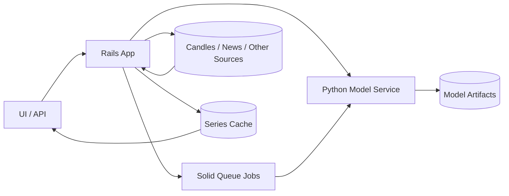
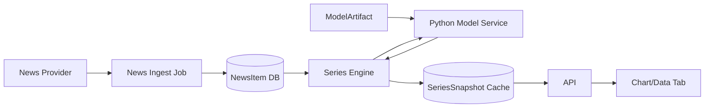
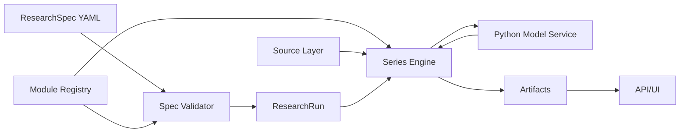

# Research Modules Plan

## Зачем нужен этот документ

Этот документ фиксирует направление развития проекта в части сложных серверных вычислений.

Его цель:

- отделить текущий быстрый режим проверки гипотез от будущего серверного research-слоя;
- зафиксировать MVP, чтобы не расползался scope;
- описать новые сущности, их состав и связи;
- разложить работу на небольшие этапы с понятной ценностью каждого шага;
- заранее спроектировать архитектуру так, чтобы потом не пришлось полностью переделывать основу.

## Исходная точка

Сейчас в проекте уже есть сильный быстрый аналитический контур:

- chart tabs;
- data tabs;
- indicator columns;
- conditions;
- простые trading systems;
- system stats.

Этот контур важен и должен сохраниться.

Практический смысл:

- текущий UI-режим нужен для быстрой ручной проверки гипотез;
- он не должен превращаться в тяжелый универсальный research framework уже на первом этапе;
- новый сложный слой должен строиться рядом, а не вместо него.

## Целевая модель

В проекте должны сосуществовать два разных режима.

### 1. Fast Lab

Это текущий интерактивный режим:

- быстро добавить индикатор;
- быстро добавить условие;
- быстро посмотреть вход и выход;
- быстро увидеть статистику;
- быстро выкинуть неинтересную гипотезу.

Свойства режима:

- минимум настройки;
- высокая скорость итерации;
- часть логики живет в браузере;
- возможна работа на локальном кэше;
- логика правил намеренно простая.

### 2. Research Modules

Это новый серверный режим:

- модульные вычисления;
- внешние данные;
- ML / neural inference;
- сложные вычисляемые ряды;
- повторяемые server-side запуски;
- позже оптимизация параметров и исследование пространства решений.

Свойства режима:

- все важные вычисления воспроизводимы на сервере;
- описание собирается из модулей;
- конфигурация хранится отдельно от UI workspace;
- сначала конфигурация руками в YAML;
- позже поверх YAML можно сделать редактор.

## Главное архитектурное решение

Быстрые `conditions` и `systems` в UI сохраняются в текущем виде.

Новый YAML / DSL не заменяет их на первом этапе.

Причина:

- у быстрых систем и у research-модулей разные цели;
- если пытаться сразу унифицировать оба слоя, проект резко усложнится;
- сначала нужно получить работающий server-side модульный контур;
- унификация может прийти позже, если появится явная польза.

Итог:

- `Fast Lab` остается простым;
- `Research Modules` строятся как отдельный серверный контур;
- общим будет не правило входа/выхода, а модульная инфраструктура данных и рядов.

## Что входит в MVP

MVP должен решить одну конкретную задачу:

- добавить отдельный локальный `Python Model Service` как единый runtime для small models;
- подключить `FinBERT` как первую реально используемую модель;
- научиться вызывать модель из Rails и получать нормализованный результат;
- на основе этого результата строить временной ряд значений по каждому бару;
- использовать этот ряд в графиках и таблицах как server-side indicator / feature;
- сохранить основу для последующего обучения собственных небольших моделей в том же сервисе.

### MVP включает

- реестр типов модулей;
- реестр моделей и артефактов;
- сущность экземпляра модуля;
- отдельный `Python Model Service`;
- загрузку и хранение новостей;
- серверный движок построения рядов;
- один модуль сентимента на inference готовой модели;
- интеграцию Rails -> Python service -> model artifact;
- API для получения результата модуля;
- отображение результата в UI;
- ручную YAML-конфигурацию research-spec для серверного запуска;
- базовую валидацию спецификации;
- базовый `research run` без сложной оптимизации.

### MVP не включает

- пользовательское обучение собственных моделей из UI;
- genetic optimization;
- Monte Carlo;
- Bayesian optimization;
- портфельный режим;
- полную замену текущих UI systems;
- визуальный DSL editor;
- автоматический поиск лучших параметров по большому пространству;
- `Ollama`, локальные LLM и LLM-first сценарии.

### Что важно зафиксировать про MVP

Хотя обучение своих моделей не входит в самый первый рабочий срез, архитектура должна сразу учитывать, что позже:

- тот же `Python Model Service` будет уметь не только inference;
- в нем же появится обучение небольших моделей;
- сначала это будут модели по табличным признакам и индикаторам;
- fine-tune больших языковых моделей на первом этапе не планируется.

## Выбранная модельная архитектура

На текущем этапе целевая архитектура должна быть проще предыдущего общего варианта.

Выбранное направление:

- Rails остается главным приложением и orchestration-слоем;
- все локальные small models выносятся в отдельный `Python Model Service`;
- `FinBERT` становится первой моделью в этом сервисе;
- позже в том же сервисе появляются собственные небольшие модели;
- `Ollama` и локальные LLM в текущий план не входят.

### Почему выбран именно такой вариант

- `FinBERT` и похожие модели естественнее запускать в Python-экосистеме;
- обучение собственных моделей тоже логичнее делать в Python;
- Rails остается проще и не обрастает тяжелыми ML-зависимостями;
- одна точка интеграции для inference и future training лучше, чем несколько независимых runtime-механизмов;
- архитектура остается достаточно простой, но легко расширяется.

### Базовая схема



### Граница ответственности

- Rails:
  - хранение конфигураций;
  - orchestration;
  - research runs;
  - series assembly;
  - интеграция с UI.
- Python Model Service:
  - загрузка моделей;
  - inference;
  - позже training;
  - единый runtime для `FinBERT` и собственных small models.

## Что такое модуль

Модуль это не просто индикатор.

Модуль это единая абстракция вычислительного блока, который:

- получает входные данные;
- имеет параметры;
- имеет фиксированный контракт выходов;
- умеет строить ряд значений на каждый timestamp;
- может опираться на цены, новости, другие модули или внешние данные.

### Типы модулей, которые проект может поддерживать позже

- `ta.*` для технических индикаторов;
- `sentiment.*` для анализа новостей;
- `regime.*` для классификации состояния рынка;
- `transform.*` для универсальных преобразований рядов;
- `cross_asset.*` для межрыночных признаков;
- `anomaly.*` для выявления аномалий;
- `ml.*` для общих ML-моделей;
- `ensemble.*` для агрегирования нескольких модулей.

### Единый контракт модуля

У любого модуля должны быть:

- `type`;
- `params`;
- `inputs`;
- `outputs`;
- `time alignment policy`;
- `warmup`;
- `execution mode`;
- `cache policy`.

### Что означает `execution_target`

`execution_target` определяет не то, можно ли показать результат в UI, а то, где модуль разрешено и целесообразно вычислять.

То есть:

- даже `server_only` модуль можно показать на графике и в таблице;
- разница в том, где происходит расчет;
- это важно и для UX, и для reproducibility, и для стоимости вычислений.

### Возможные значения

- `server_only`:
  - модуль исполняется только на сервере;
  - обычно потому, что он зависит от внешних данных, модели, тяжелых вычислений или должен быть канонически воспроизводим;
  - пример: `sentiment.news_transformer`, `regime.nn_classifier`.
- `server_preferred`:
  - модуль теоретически можно посчитать и в браузере, и на сервере;
  - но сервер считается основным исполнителем для research-запусков, длинной истории, единого результата и кеширования;
  - пример: сложный составной price-feature module.
- `client_capable`:
  - модуль достаточно легкий и детерминированный, чтобы его можно было исполнять прямо в браузере;
  - это полезно для текущего быстрого режима;
  - пример: `sma`, `ema`, `lag`, `diff`, `rolling_mean`.

### Практический смысл для проекта

Для текущего проекта это действительно означает следующее:

- часть модулей можно использовать как быстрые клиентские индикаторы;
- часть модулей слишком тяжелые или завязаны на внешние источники и потому считаются только на сервере;
- часть модулей может существовать в обоих мирах, но в research-режиме серверный результат считается основным.

Иными словами:

- `execution_target` управляет местом вычисления;
- а не тем, можно ли результат использовать в интерфейсе.

## Универсальные transforms

`transform`-модули нужны, чтобы не плодить отдельный модуль под каждую простую производную задачу.

Это базовые операции над временными рядами.

### Примеры

- `lag(x, 1)` - значение предыдущего бара;
- `diff(x)` - разница между текущим и предыдущим значением;
- `return(x, n)` - доходность за `n` баров;
- `zscore(x, window)` - нормализация относительно скользящего окна;
- `rank(x, window)` - положение значения внутри окна;
- `quantile(x, window)` - квантиль текущего значения внутри окна;
- `rolling_mean/std/min/max` - скользящие статистики;
- `normalize` - приведение к общей шкале;
- `resample` - перевод источника в нужный timeframe;
- `join` - объединение нескольких рядов по времени.

### Зачем они нужны

- позволяют строить новые признаки без написания нового Ruby-кода;
- одинаково полезны для price-модулей, news-модулей и ML-моделей;
- делают систему более композиционной;
- уменьшают количество почти одинаковых кастомных индикаторов.

### Как это применяется на реальных примерах

Ниже показано, зачем эти операции нужны не сами по себе, а в контексте твоих модулей.

### Пример 1. `sentiment.news_transformer`

Допустим, модуль на входе получает новости по `BTCUSD` и выдает сырые значения:

- `score`;
- `confidence`;
- `news_count`.

Дальше transforms позволяют превратить этот сырой выход в более полезные ряды.

Примеры:

- `resample(news_sent.score, 1h)`:
  - новости приходят в произвольное время;
  - их нужно уложить в баровую сетку `1h`, чтобы ряд можно было совмещать со свечами.
- `rolling_mean(news_sent.score, 6)`:
  - сглаживает случайный шум отдельных новостей;
  - дает более устойчивый фон настроения.
- `diff(news_sent.score)`:
  - показывает не сам уровень сентимента, а его изменение;
  - полезно для поиска резких разворотов новостного фона.
- `lag(news_sent.score, 1)`:
  - дает значение предыдущего бара;
  - полезно для признаков вида “сейчас настроение улучшается относительно прошлого часа”.
- `zscore(news_sent.news_count, 48)`:
  - показывает, насколько текущий всплеск новостей аномален относительно последних 48 баров;
  - помогает отличить обычный поток новостей от события.
- `quantile(news_sent.score, 168)`:
  - показывает, находится ли текущий сентимент в верхних или нижних экстремумах недели;
  - полезно для фильтров вроде “работать только когда новостной фон действительно экстремален”.
- `join(price_returns, news_sent.score)`:
  - совмещает ценовой и новостной ряды в одну таблицу признаков;
  - это уже база для ML-модуля или сложного классификатора.

Практическая польза:

- один sentiment module не обязан сразу уметь все производные вычисления;
- он выдает базовые ряды;
- transforms позволяют на их основе быстро строить дополнительные признаки.

### Пример 2. `regime classifier`

Даже если классификатор состояния рынка потом будет нейросетевым, на вход ему все равно почти всегда нужны подготовленные признаки.

Примеры подготовки:

- `return(close, 1)`:
  - базовая доходность по бару;
  - показывает локальное направление.
- `return(close, 24)`:
  - более медленный горизонт;
  - помогает различать локальный шум и среднесрочное движение.
- `rolling_std(return(close, 1), 24)`:
  - оценка краткосрочной волатильности;
  - важна для отличия trend/range от stress/high-vol режимов.
- `zscore(volume, 48)`:
  - показывает аномальность объема;
  - помогает отделять обычную торговлю от событийного режима.
- `lag(rsi_14, 1)`:
  - позволяет сравнивать динамику индикатора со вчерашним/предыдущим состоянием;
  - полезно для построения производных признаков.
- `diff(ema_fast - ema_slow)`:
  - показывает ускорение или ослабление тренда;
  - это уже более информативный признак, чем просто факт пересечения.
- `rank(realized_vol, 168)`:
  - показывает, насколько текущая волатильность высока относительно недели;
  - помогает классификатору видеть относительный контекст.
- `join(price_features, sentiment_features)`:
  - объединяет ценовые, объемные и новостные признаки;
  - позволяет строить классификатор режима не только по цене, но и по внешнему фону.

Практическая польза:

- transforms создают feature engineering слой;
- без них любой `regime classifier` быстро превратится в большой монолитный кастомный модуль;
- с ними сам классификатор можно держать маленьким и специализированным.

## Новые сущности

Ниже перечислены сущности нового слоя. Не все из них обязаны сразу стать отдельными таблицами БД в MVP, но модель должна быть зафиксирована заранее.

## ModuleType

Это описание класса модулей.

Примеры:

- `sentiment.news_transformer`;
- `transform.zscore`;
- `ta.rsi`;
- `cross_asset.relative_strength`.

Где живет:

- в кодовом реестре на первом этапе;
- позже может частично дублироваться в metadata endpoint.

Состав:

- `key` - уникальный ключ типа модуля;
- `name` - человекочитаемое имя;
- `category` - `sentiment`, `transform`, `ta`, `ml`, `cross_asset`;
- `description`;
- `params_schema` - какие параметры допустимы;
- `input_schema` - какие входы нужны;
- `output_schema` - какие выходы дает модуль;
- `execution_target` - `server_only`, `server_preferred`, `client_capable`;
- `warmup_bars`;
- `alignment_policy`;
- `cache_policy`;
- `artifact_requirement` - нужна ли внешняя модель;
- `supports_training` - пока почти всегда `false`.

### Расшифровка полей `ModuleType`

- `key`:
  - машинное имя типа модуля;
  - используется в YAML, API и кодовом реестре;
  - пример: `sentiment.news_transformer`.
- `name`:
  - человекочитаемое название для UI и документации;
  - пример: `News Sentiment Transformer`.
- `category`:
  - логическая группа модулей;
  - нужна для навигации, фильтрации и понимания назначения;
  - пример: `sentiment`, `transform`, `ta`, `ml`.
- `description`:
  - короткое объяснение, что модуль делает;
  - нужно для справки и будущего UI-конфигуратора.
- `params_schema`:
  - описание допустимых параметров;
  - для каждого параметра нужны тип, обязательность, диапазон, default и, если надо, enum-значения;
  - пример: `lookback_hours: integer >= 1`, `decay: float 0..1`.
- `input_schema`:
  - описание того, какие входы ожидает модуль;
  - это не значения, а контракт входов;
  - пример: “нужен текстовый event source”, “нужен OHLCV series”, “нужен другой series module output”.
- `output_schema`:
  - список выходов модуля и их типов;
  - пример: `score: float`, `confidence: float`, `news_count: int`.
- `execution_target`:
  - место, где модуль должен исполняться;
  - значения описаны выше;
  - это про исполнение, а не про отображение.
- `warmup_bars`:
  - сколько исторических баров нужно до первой валидной точки результата;
  - пример: у `zscore(window=48)` первые корректные значения появятся только после накопления окна.
- `alignment_policy`:
  - правило привязки выхода к таймстампу;
  - особенно важно для event-driven источников вроде новостей;
  - примеры: `bar_close`, `event_time_to_current_bar`, `carry_forward_until_next`.
- `cache_policy`:
  - как можно кешировать результат;
  - пример: `no_cache`, `range_cache`, `symbol_timeframe_cache`, `artifact_sensitive_cache`.
- `artifact_requirement`:
  - нужен ли внешний модельный артефакт;
  - возможные состояния: `none`, `required`, `optional`;
  - для `sentiment.news_transformer` на первом этапе обычно `required`.
- `supports_training`:
  - означает не то, что обучение уже есть, а то, предусматривает ли тип модуля future training pipeline;
  - для MVP у большинства модулей это будет `false`.

### Пример output schema

Для `sentiment.news_transformer`:

- `score: float`
- `confidence: float`
- `news_count: int`

## ModuleInstance

Это конкретно настроенный экземпляр модуля.

Именно его пользователь фактически создает, настраивает, сохраняет и переиспользует.

Примеры:

- `BTC news sentiment 6h`;
- `ETH sentiment aggressive`;
- `BTC vs ETH relative strength`.

Где живет:

- в PostgreSQL.

Состав:

- `id`;
- `user_id` - если модуль пользовательский;
- `name`;
- `module_type_key`;
- `status` - `draft`, `active`, `archived`, `invalid`;
- `params` - JSONB с настройками;
- `input_bindings` - JSONB, как связаны источники данных;
- `output_aliases` - JSONB, если выходы нужно переименовать;
- `symbol_scope` - один инструмент или правило подстановки;
- `timeframe_scope`;
- `range_defaults`;
- `model_artifact_id` - если используется модель;
- `notes`;
- `created_at`, `updated_at`.

### Что важно

- `ModuleType` отвечает за контракт;
- `ModuleInstance` отвечает за конкретную конфигурацию.

Именно здесь хранится то, что ты описывал как:

- “есть список модулей”;
- “у них единая архитектура”;
- “есть настройки”;
- “открываем и настраиваем конкретный экземпляр”;
- “сохраняем и переиспользуем”.

## ModelArtifact

Это зарегистрированный артефакт модели.

Нужен для inference-first подхода.

Это не результат вычисления и не конфигурация модуля.

`ModelArtifact` это упакованная, версионированная модель, которую `Python Model Service` умеет загрузить и использовать.

Если упростить:

- `ModuleType` говорит, какой класс модуля существует;
- `ModuleInstance` говорит, как конкретно настроен экземпляр;
- `ModelArtifact` говорит, какой именно файл модели и связанные с ним metadata нужно взять для расчета;
- `Python Model Service` выполняет фактический inference или training по этому артефакту.

Где живет:

- metadata в PostgreSQL;
- бинарный файл в файловом хранилище.

Состав:

- `id`;
- `key`;
- `version`;
- `runtime_kind` - сейчас основной вариант `python_service`;
- `framework` - `transformers`, `onnxruntime`, `pytorch`, `sklearn`, `xgboost`;
- `task_type` - `sentiment`, `classification`, `regression`, `embedding`;
- `service_model_key` - внутренний ключ модели в Python service;
- `storage_path`;
- `checksum`;
- `labels` - JSONB;
- `tokenizer_config` - JSONB;
- `training_metadata` - JSONB;
- `input_contract` - JSONB;
- `output_contract` - JSONB;
- `status` - `ready`, `deprecated`, `broken`;
- `created_at`.

### Что физически может входить в артефакт

В зависимости от backend это может быть:

- файл модели, например ONNX;
- веса PyTorch;
- tokenizer или словарь токенизации;
- метки классов;
- информация о версии;
- checksum;
- metadata о том, как интерпретировать выход модели.

### Как это работает на примере сентимента

Допустим, есть артефакт:

- `key = finbert_crypto_news`
- `version = 1`
- `runtime_kind = python_service`
- `framework = transformers` или `onnxruntime`
- `task_type = sentiment`
- `service_model_key = finbert_crypto_news_v1`
- `storage_path = models/finbert_crypto_news_v1.onnx`

Тогда процесс такой:

1. `ModuleInstance` типа `sentiment.news_transformer` ссылается на `model_artifact_id`.
2. `Series Engine` запрашивает новости по нужному символу и диапазону.
3. Rails вызывает `Python Model Service` и передает `service_model_key`.
4. Python service загружает `ModelArtifact`.
5. Из `tokenizer_config` берутся правила токенизации текста.
6. Заголовок и/или текст новости прогоняется через модель.
7. Модель возвращает вероятности классов вроде `negative`, `neutral`, `positive`.
8. Adapter переводит это в нормализованный результат модуля:
   - `score`
   - `confidence`
   - `news_count`
9. Дальше этот событийный поток агрегируется в bar-aligned series.

То есть `ModelArtifact` нужен, чтобы модуль не хранил внутри себя “магическую ссылку на модель”, а работал через явный и версионированный объект, а исполнение при этом шло через отдельный Python runtime.

### Почему это важно

- можно менять версии модели без смены всей архитектуры;
- можно сравнивать результаты разных моделей;
- можно логировать, какая именно модель использовалась в `ResearchRun`;
- можно позже добавить обучение, не ломая runtime-контур.

### Почему FinBERT надо мыслить отдельно от анализа новостей

Это важное архитектурное разделение.

`FinBERT` это не “новостной модуль” и не “sentiment system”.

`FinBERT` это модельный артефакт и runtime для задачи классификации текста.

А вот `sentiment.news_transformer` это уже прикладной модуль, который:

- берет новости как источник данных;
- подготавливает текст;
- вызывает модель;
- интерпретирует выход модели;
- агрегирует предсказания в bar-aligned series.

То есть слои должны быть такими:

- `Source Layer` отвечает за получение новостей;
- `Inference Layer` отвечает за запуск модели;
- `Series Module` отвечает за прикладную бизнес-логику.

Это разделение нужно потому что потом можно будет использовать похожий runtime не только для сентимента.

Примеры:

- `FinBERT` для сентимента новостей;
- другая текстовая модель для классификации типа новости;
- модель для topic detection;
- табличная модель по ценовым признакам;
- классификатор состояния рынка по feature table.

Иными словами:

- модель и модуль это разные вещи;
- источник данных и модель это тоже разные вещи;
- именно поэтому `ModelArtifact` и `SourceRecord` описаны отдельно.

### На первом этапе

Модель только используется.

Training в `Python Model Service` архитектурно уже предполагается, но в MVP не реализуется как пользовательский workflow.

## SourceRecord

На уровне архитектуры лучше мыслить не только сущностью `NewsItem`, а общей абстракцией нормализованной записи источника данных.

Эту абстракцию можно назвать `SourceRecord`.

Смысл:

- разные модули могут работать на разных типах входных данных;
- у сентимента это новости;
- у другого модуля это могут быть macro events, on-chain события, funding snapshots или еще что-то;
- модульный слой должен уметь жить не только на свечах и новостях.

### Что такое `SourceRecord`

Это нормализованная единица внешних или дополнительных данных, пригодная для server-side модулей.

Базовый состав:

- `id`;
- `source_type` - `news`, `macro_event`, `funding`, `onchain`, `custom`;
- `provider`;
- `external_id`;
- `event_time`;
- `ingested_at`;
- `entity_refs` - к каким инструментам, темам или сущностям относится запись;
- `payload` - нормализованные данные;
- `raw_payload` - исходный ответ провайдера;
- `language` - если применимо;
- `status`.

### Почему нужна именно такая абстракция

- она не привязывает всю систему только к новостям;
- позволяет строить единый `Source Layer`;
- упрощает появление новых типов модулей;
- делает `sentiment` только первым случаем, а не всей моделью данных.

### Что будет в MVP

В MVP общий слой будет уже продуман архитектурно, но первая конкретная реализация `SourceRecord` будет именно `NewsItem`.

То есть:

- концептуально источник общий;
- практически первая таблица и первый ingest pipeline будут новостными.

## NewsItem как первая реализация `SourceRecord`

Это атомарная единица новостных данных.

Без нее `sentiment`-модуль не на чем будет работать.

Где живет:

- в PostgreSQL.

Состав:

- `id`;
- `provider`;
- `external_id`;
- `published_at`;
- `title`;
- `body` или `summary`;
- `url`;
- `language`;
- `symbols` - JSONB или отдельная связь;
- `asset_class`;
- `importance` - если дает провайдер;
- `raw_payload` - JSONB;
- `ingested_at`.

### Важные свойства

- новости должны быть дедуплицированы;
- должна быть явная привязка к инструментам или темам;
- должна быть сохранена публикация по времени, чтобы не было lookahead leakage.

## SeriesSnapshot

Это кешированный результат вычисления модуля на диапазоне данных.

Нужен, чтобы не пересчитывать тяжелые серии каждый раз.

Где живет:

- metadata в PostgreSQL;
- сами данные либо в PostgreSQL, либо в файловом/columnar-хранилище.

Состав:

- `id`;
- `module_instance_id`;
- `symbol`;
- `timeframe`;
- `range_start`;
- `range_end`;
- `input_signature`;
- `params_signature`;
- `output_payload_ref`;
- `status`;
- `computed_at`.

## ResearchSpec

Это YAML-описание серверного исследования.

Нужно для повторяемых запусков.

Где живет:

- как YAML-файл на первом этапе;
- позже может храниться в БД.

Состав:

- `version`;
- `dataset`;
- `module_refs`;
- `outputs`;
- `run_options`;
- `notes`.

### Пример структуры

```yaml
version: 1

dataset:
  symbol: BTCUSD
  timeframe: 1h
  range: 90d

modules:
  - id: sent_btc
    instance: btc_news_sentiment_6h

outputs:
  - sent_btc.score
  - sent_btc.confidence
  - sent_btc.news_count
```

## ResearchRun

Это конкретный запуск server-side вычисления по спецификации.

Где живет:

- в PostgreSQL;
- артефакты могут лежать в БД и/или файлах.

Состав:

- `id`;
- `user_id`;
- `name`;
- `spec_version`;
- `spec_payload` - JSONB snapshot;
- `status` - `queued`, `running`, `completed`, `failed`, `cancelled`;
- `started_at`, `finished_at`;
- `summary` - JSONB;
- `logs` - JSONB или отдельная таблица;
- `artifacts` - ссылки на series/results;
- `error_message`.

## Поздние сущности, не для MVP

Эти сущности полезны позже, но их не нужно делать сразу:

- `TrainingDataset`;
- `LabelDefinition`;
- `TrainingRun`;
- `OptimizationRun`;
- `OptimizationCandidate`;
- `ValidationReport`;
- `PortfolioSpec`.

## Технические подсистемы нового слоя

## 1. Module Registry

Это центральный реестр типов модулей.

Он должен отвечать на вопросы:

- какие модули вообще существуют;
- какие у них параметры;
- какие входы они ждут;
- какие выходы они генерируют;
- нужен ли model artifact;
- можно ли исполнять модуль только на сервере.

### Зачем нужен

- единая точка правды по модулям;
- основа для YAML validation;
- основа для будущего UI editor;
- основа для автодополнения и справки.

## 2. Source Layer

Это слой доступа к исходным данным.

На первом этапе он должен покрыть:

- свечи;
- новости.

Позже сюда могут добавиться:

- cross-asset данные;
- индексы;
- macro events;
- funding / open interest;
- on-chain данные.

### Внутренние компоненты

- `CandleSource`;
- `NewsSource`;
- `SourceNormalizer`;
- `TimeBucketAligner`.

## 3. Series Engine

Это главный вычислительный движок server-side модулей.

Он должен:

- читать входные данные;
- строить dependency graph модулей;
- рассчитывать модули в правильном порядке;
- выравнивать результаты по времени бара;
- возвращать именованные ряды;
- кешировать результат.

### Внутренние компоненты

- `SpecParser`;
- `SpecValidator`;
- `DependencyResolver`;
- `InputResolver`;
- `ModuleExecutor`;
- `TimeAligner`;
- `SeriesAssembler`;
- `SeriesCache`.

### Что значит "выравнивать по времени"

Для любого результата должно быть однозначно понятно:

- к какому бару относится значение;
- допускается ли carry-forward;
- как аггрегируется событие новости в бар;
- как обрабатываются пустые значения;
- когда значение становится известным.

### Это критично потому что

- иначе легко получить lookahead bias;
- без этого невозможно корректно смешивать цены и новости;
- без этого невозможно сделать позже режим оптимизации.

## 4. Python Model Service

Это отдельный локальный сервис на Python, который отвечает за запуск моделей.

На текущем этапе это основной и единственный планируемый model runtime.

### Почему он нужен

- `FinBERT` и похожие модели проще и надежнее обслуживать в Python;
- собственные небольшие модели по табличным признакам тоже естественно обучать в Python;
- Rails не должен обрастать тяжелыми ML-зависимостями;
- один сервис для inference и future training проще, чем несколько разных механизмов.

### Что он должен уметь в MVP

- загрузить зарегистрированный `ModelArtifact`;
- принять нормализованный вход от Rails;
- выполнить inference;
- вернуть стандартизированный результат;
- логировать модель, версию и параметры вызова;
- работать локально без внешнего model API.

### Что он должен уметь позже

- обучать небольшие модели;
- сохранять новые model artifacts;
- запускать feature-based classification / regression;
- переиспользовать единый registry и storage.

### Что он не должен делать

- хранить бизнес-логику research-модулей;
- собирать финальный series для UI;
- управлять workspace или preset-логикой;
- заменять Rails как orchestration-слой.

### Рекомендуемый стек сервиса

Базовый стек:

- `Python`
- `FastAPI` или другой простой HTTP framework
- `transformers` для готовых текстовых моделей
- `onnxruntime` там, где нужен более легкий runtime
- `PyTorch` для будущих собственных небольших моделей
- позже `scikit-learn` / `xgboost` для табличных small models, если потребуется

### Базовый контракт сервиса

Сервис должен поддерживать простой и узкий API.

На первом этапе достаточно:

- `POST /models/:key/predict_text`
- `POST /models/:key/predict_features`
- `GET /models/:key/health`

Позже добавятся:

- `POST /models/:key/train`
- `GET /training_runs/:id`
- `POST /models/register`

### Как мыслить этот слой архитектурно

`Python Model Service` не должен знать, что именно он считает “сентимент новостей” или “режим рынка”.

Он должен уметь делать общую вещь:

- принять вход;
- загрузить нужный `ModelArtifact`;
- выполнить inference или training;
- вернуть raw result в стандартизированном виде.

Поверх него уже строятся task-specific adapters в домене приложения.

Примеры adapters на стороне Rails:

- `TextSentimentAdapter`;
- `TextClassificationAdapter`;
- `FeatureClassificationAdapter`;
- `FeatureRegressionAdapter`.

### Рекомендуемая схема для MVP

Для MVP путь должен быть таким:

1. `Source Layer` получает `NewsItem`.
2. Rails собирает текст для модели.
3. Rails вызывает `Python Model Service`.
4. Python service запускает `FinBERT`.
5. `TextSentimentAdapter` на стороне Rails переводит raw logits / probabilities в:
   - `score`
   - `confidence`
   - `label`
6. `Series Engine` агрегирует это в series по барам.

### Что означает “локально” технически

В контексте проекта “локально” означает:

- сервис работает на той же машине или в том же deployment-окружении, что и приложение;
- inference не идет через внешний SaaS;
- модельные файлы лежат в локальном storage проекта или рядом с ним;
- Rails обращается к сервису по внутреннему адресу, например `localhost`.

### Почему это достаточно просто

- у системы только один model runtime;
- нет необходимости тащить `Ollama`;
- нет дублирования между Ruby runtime и Python runtime;
- later training естественно добавляется в ту же архитектуру.

## 5. Training Layer

Это будущий слой обучения собственных небольших моделей в том же `Python Model Service`.

Он не входит в MVP как пользовательский сценарий, но должен быть предусмотрен архитектурно.

### Что здесь планируется позже

- формирование датасета по индикаторам и признакам;
- обучение классификаторов ситуаций рынка;
- сохранение новых `ModelArtifact`;
- inference этими моделями через тот же сервис.

### Примеры будущих моделей

- классификация ситуаций рынка по price/volume/indicator features;
- бинарные модели “интересная ситуация / неинтересная ситуация”;
- модели вероятности события;
- небольшие регрессионные модели по табличным признакам.

### Важный принцип

Training и inference должны использовать одну и ту же модельную инфраструктуру:

- один registry;
- один storage;
- один Python runtime;
- один контракт регистрации артефактов.

## 6. Research Run Layer

Это orchestration-слой для повторяемых серверных запусков.

Он должен:

- принять YAML spec;
- провалидировать ее;
- собрать зависимости;
- создать `ResearchRun`;
- посчитать ряды;
- сохранить артефакты;
- отдать результат через API.

## Схема работы системы

## Поток данных для сентимент-модуля



## Поток server-side research run



## Пользовательский процесс работы

Ниже показан желаемый процесс работы пользователя после MVP.

### Сценарий 1. Создать и настроить модуль

1. Пользователь выбирает тип модуля.
2. Создает `ModuleInstance`.
3. Настраивает параметры.
4. Привязывает входы.
5. Сохраняет конфигурацию.

Результат:

- появляется переиспользуемый экземпляр модуля.

### Сценарий 2. Получить ряд от модуля

1. UI или API запрашивает вычисление `ModuleInstance`.
2. Сервер подтягивает цены и/или новости.
3. `Series Engine` рассчитывает ряд.
4. Результат возвращается как серверный ряд значений.
5. UI показывает его как overlay, data column или отдельный источник.

### Сценарий 3. Повторно использовать модуль

1. Пользователь берет уже созданный `ModuleInstance`.
2. Подключает его в другом контексте.
3. Меняет параметры при необходимости.
4. Получает новый ряд без переписывания логики модуля.

### Сценарий 4. Запустить research spec

1. Пользователь руками пишет YAML.
2. Загружает или отправляет его на сервер.
3. Сервер валидирует спецификацию.
4. Создается `ResearchRun`.
5. Выполняются вычисления.
6. Сохраняются артефакты.
7. Пользователь получает результат и логи.

## Этапы реализации

Ниже приведен рекомендуемый порядок внедрения.

Каждый этап маленький и должен завершаться рабочим артефактом.

## Этап 0. Зафиксировать рамки

### Что добавляется

- этот план;
- терминология;
- граница между `Fast Lab` и `Research Modules`.

### Зачем

- чтобы не смешивать быстрый UI-режим и новый серверный контур;
- чтобы MVP не расползался.

### Критерий завершения

- команда одинаково понимает, что входит в MVP, а что нет.

## Этап 1. Реестр модулей и контракты

### Что добавляется

- `Module Registry`;
- `Model Registry`;
- описание `ModuleType`;
- `params_schema`, `input_schema`, `output_schema`;
- metadata API со списком типов модулей;
- базовый контракт `ModelArtifact`.

### Зачем

- это основа всего дальнейшего слоя;
- без контракта нельзя валидировать конфигурации;
- без контракта нельзя строить UI настройки.

### Минимальный результат

- сервер знает, что такое `sentiment.news_transformer`;
- сервер знает, что такое `finbert_crypto_news_v1`;
- сервер может отдать метаданные типов модулей и зарегистрированных моделей через API.

## Этап 2. Источник новостей

### Что добавляется

- сущность `NewsItem`;
- job загрузки новостей;
- нормализация входного формата;
- дедупликация;
- связывание новости с символами или темами.

### Зачем

- без нормального слоя новостей модуль сентимента не на чем считать;
- это независимый фундамент для любых future news/event модулей.

### Минимальный результат

- сервер хранит новости по времени и символам;
- можно запросить новости по `symbol + range`.

## Этап 3. Python Model Service Core

### Что добавляется

- отдельный Python service;
- загрузка `ModelArtifact`;
- текстовый inference endpoint;
- health endpoint;
- локальный storage для модельных файлов;
- интеграция Rails -> Python service.

### Зачем

- это единый runtime для всех small models;
- без него `FinBERT` станет разовым исключением;
- он же потом будет использоваться для обучения собственных моделей.

### Минимальный результат

- Rails может вызвать Python service и получить результат text-classification от зарегистрированной модели.

## Этап 4. Series Engine Core

### Что добавляется

- `InputResolver`;
- `TimeAligner`;
- `SeriesAssembler`;
- `SeriesSnapshot` cache;
- единый формат server-side series response.

### Зачем

- сентимент это не просто один endpoint, а вычисление ряда по диапазону;
- этот движок потом будет использоваться и для любых других модулей.

### Минимальный результат

- сервер умеет построить любой простой ряд по диапазону и вернуть его по таймстампам.

## Этап 5. Первый модуль `news sentiment`

### Что добавляется

- `ModelArtifact`;
- интеграция с `Python Model Service`;
- executor для `sentiment.news_transformer`;
- агрегация новостей в bar-aligned series;
- выходы `score`, `confidence`, `news_count`.

### Зачем

- это первый реальный модуль нового слоя;
- после него архитектура перестает быть абстракцией.

### Минимальный результат

- по `BTCUSD + timeframe + range` сервер отдает sentiment series.

## Этап 6. ModuleInstance и сохранение конфигураций

### Что добавляется

- таблица / модель `ModuleInstance`;
- CRUD API;
- хранение `params`, `input_bindings`, `output_aliases`;
- связывание с `ModelArtifact`.

### Зачем

- модуль должен быть переиспользуемым объектом, а не разовой ручной настройкой;
- это дает основу для будущего UI-конфигуратора.

### Минимальный результат

- пользователь может создать именованный экземпляр сентимент-модуля и использовать его повторно.

## Этап 7. Интеграция в текущий UI

### Что добавляется

- возможность запрашивать `ModuleInstance` как server-side indicator / feature;
- отображение результатов на графике;
- подключение результата в data tab как дополнительной колонки.

### Зачем

- это связывает новый слой с уже существующим рабочим контуром;
- пользователь начинает видеть пользу без ожидания полной research-платформы.

### Минимальный результат

- sentiment series можно открыть на графике и в таблице.

## Этап 8. ResearchSpec и ResearchRun

### Что добавляется

- YAML spec;
- parser и validator;
- сущность `ResearchRun`;
- job выполнения запуска;
- сохранение артефактов и логов.

### Зачем

- нужен повторяемый server-side процесс;
- это уже не “разово запросить ряд”, а “формально описать исследование”.

### Минимальный результат

- пользователь может вручную подать YAML и получить воспроизводимый run.

## Этап 9. Feature Dataset Builder для собственных моделей

### Что добавляется

- построение датасета из свечей, индикаторов и transforms;
- сохранение feature table для обучения;
- описание label configuration;
- экспорт данных в `Python Model Service`.

### Зачем

- без feature dataset builder нельзя нормально перейти от готовых моделей к своим собственным;
- это первый мост от research-модулей к supervised learning.

### Минимальный результат

- по заданной спецификации можно собрать датасет для классификации ситуаций рынка.

## Этап 10. Обучение небольших собственных моделей

### Что добавляется

- training endpoint в `Python Model Service`;
- запуск training jobs;
- регистрация нового `ModelArtifact`;
- inference новыми моделями через тот же runtime.

### Зачем

- это следующий логичный шаг после `FinBERT`;
- позволяет использовать собственные классификаторы по индикаторам и другим признакам;
- не требует новой архитектуры, потому что строится на уже существующем Python runtime.

### Минимальный результат

- можно обучить простую модель классификации ситуаций по табличным признакам и использовать ее в research-модулях.

## Этап 11. Простейший parameter sweep

### Что добавляется

- последовательный перебор ограниченного числа параметров;
- сохранение результатов кандидатов;
- сравнительная выдача метрик.

### Зачем

- это первый полезный шаг к оптимизации;
- дает практический исследовательский эффект без генетики и сложных алгоритмов.

### Минимальный результат

- можно прогнать небольшой набор конфигураций `sentiment`-модуля и сравнить результаты.

## Этап 12. Модули второго поколения

После стабилизации платформы можно добавлять:

- `transform.*`;
- `cross_asset.*`;
- `regime.*`;
- `anomaly.*`.

### Почему не раньше

- без работающего модульного контура новые модули только увеличат хаос;
- сначала должен стабилизироваться runtime, storage и API.

## Этап 13. Сложная оптимизация и расширенный validation layer

Это сознательно поздний этап.

Сюда относятся:

- walk-forward;
- Monte Carlo;
- genetic search;
- Bayesian search;
- портфельные запуски.

### Почему это поздно

- без устойчивого inference-контура и repeatable runs сложная оптимизация даст хрупкую систему;
- сначала нужен стабильный фундамент для данных, model service, спецификаций и артефактов.

## API-контур, который потребуется

Это ориентир, а не точный контракт первого коммита.

### Module types

- `GET /api/module_types`
- `GET /api/module_types/:key`

### Model artifacts

- `GET /api/model_artifacts`
- `POST /api/model_artifacts`
- `GET /api/model_artifacts/:id`

### Module instances

- `GET /api/module_instances`
- `POST /api/module_instances`
- `GET /api/module_instances/:id`
- `PATCH /api/module_instances/:id`
- `DELETE /api/module_instances/:id`
- `POST /api/module_instances/:id/compute`

### Research

- `POST /api/research_specs/validate`
- `POST /api/research_runs`
- `GET /api/research_runs`
- `GET /api/research_runs/:id`
- `GET /api/research_runs/:id/artifacts`

### Python model service

Внутренний сервисный API:

- `POST /models/:key/predict_text`
- `POST /models/:key/predict_features`
- `GET /models/:key/health`
- позже `POST /models/:key/train`

## Риски и заранее известные сложности

## 1. Time alignment и leakage

Главный технический риск.

Нужно всегда явно определять:

- когда новость стала известна;
- в какой бар она попадает;
- можно ли переносить значение вперед;
- как обрабатываются пустые окна.

## 2. Разрастание UI раньше backend-фундамента

Если начать с красивого редактора, а не с server-side контрактов, придется переделывать основу.

## 3. Смешение workspace-state и research-state

`Preset.payload` не должен становиться контейнером всей новой research-логики.

Workspace и research нужно хранить отдельно.

## 4. Слишком ранний переход к обучению без data pipeline

Если рано добавить training pipeline:

- резко вырастет сложность;
- появится много артефактов;
- усложнится reproducibility.

Поэтому сначала:

- модельный runtime;
- готовая модель `FinBERT`;
- feature dataset builder;
- и только потом training своих моделей.

## Что считать успешным завершением MVP

MVP считается успешным, если выполняются все условия:

- есть серверный `Module Registry`;
- есть `Model Registry`;
- есть отдельный локальный `Python Model Service`;
- есть `ModuleInstance`;
- есть источник новостей;
- есть один рабочий `sentiment`-модуль;
- есть рабочий `FinBERT` как первый `ModelArtifact`;
- модуль строит bar-aligned series;
- series можно показать на графике и в таблице;
- можно руками описать и запустить простой YAML-based `ResearchRun`;
- архитектура не ломает текущий быстрый UI-режим.

## Короткий итог

Первый этап проекта это не “сразу построить всю платформу количественных исследований”.

Первый этап это:

- выделить отдельный серверный модульный слой;
- добавить отдельный локальный `Python Model Service`;
- сделать его на одном реальном `ModelArtifact` - `FinBERT`;
- поверх этого собрать модуль сентимента;
- научиться хранить конфигурации модулей;
- научиться получать временные ряды;
- научиться запускать простой воспроизводимый research run.

После этого у проекта уже появится понятная ось развития:

- новые модули;
- новые источники данных;
- новые серверные вычисления;
- позже обучение и оптимизация.
